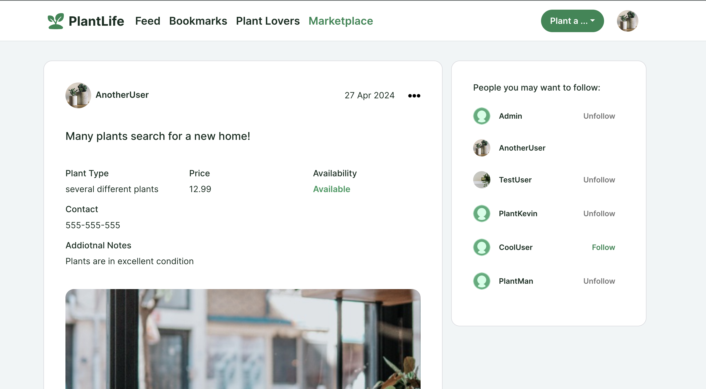

# PlantLife

With so many social media platforms out there, PlantLife aims to be a home for people who want to celebrate everything plant. Plant enthusiasts can present their newest acquisitions, share useful tips, buy, sell or exchange plants with others - or just geek out on any plant related topics.

[Link to the project](https://plantlife-a6c78053fb92.herokuapp.com/)

## Product Decisions 

### User Needs
As a user I want to...
- ...meet other plant enthusiasts so that I can build new connections with likeminded people
- ...exchange information with other users so that I can learn new things about plants
- ...follow people that post interesting plant content so that my feed filters out any uninteresting topics
- ...buy, sell or give away plants so that I can expand my collection or share my own plants with others

### MVP
PlantLife’s MVP is meant to be a simple version of a social media app that brings together plant enthusiasts from around the world. Core features consist of profile customization, reading, writing, editing and deleting posts and advertisements as well as an overview of all users with the option to follow each other.

## Design Decisions

### Wireframes
Creating the wireframes before the start of development allowed more time for the coding phase as a lot of time was saved by having less need for design changes.

[Link to all wireframes](https://github.com/dev-timm/plantlife/tree/main/src/assets/README/wireframes)

### Usability

#### Layout
The layout is usually organized within 1-2 columns so that the actions and important content are easy to see.

#### Colors
The primary color is a vibrant green that represents nature and plants. It has a good contrast to white, which is important for UI elements such as buttons. Overall the color should give a positive feeling to the user and make it easy to identify important elements.

## Features

### Sign Up
Clicking on the Sign Up link on the NavBar or the link below the Sign In page will bring the user to the Sign Up page. There the user can create an account by entering a username, password and the same password again. If the user already has an account, they can click on the link below the button which will bring them to the Sign In page.

### Sign In
Clicking on the Sign In link on the NavBar or the link below the Sign Up page will bring the user to the Sign In page. There the user can log in to their account by entering their username and password. If the user does not have an account yet, they can click on the link below the button which will bring them to the Sign Up page.

### NavBar
On top of each page is the NavBar. There are two versions of the NavBar - one is displayed when the user is not signed in and the other one is shown when the user is currently signed in. Whenever the user is not signed in they only see the logo with the sign in and sign up button. If the user is signed in they see a collection of all available links such as Feed, Bookmarks, Plant Lovers and Marketplace. Additionally users have access to a button to create a post or advertisement as well as their profile picture which gives them the option to view their profile or log out.

### Homepage
The Homepage is the first page visible to the users whether they are signed in or not. The page shows all posts ordered by date, a search bar and an order dropdown. There is also a widget on the side that displays popular users. Posts can be filtered through search by post title and username. Moreover, they can be ordered by date, number of likes and number of comments. The Homepage can be accessed by clicking on the Logo in the NavBar.

#### Feed
On the Feed page the users see posts from people they follow. Additionally, it contains the search bar, order dropdown and popular profiles widget. Posts can be filtered through search by post title and username. Moreover, they can be ordered by date, number of likes and number of comments.

#### Bookmarks
The Bookmarks page displays all posts the user has saved to view at a later time. Bookmarks can easily be created by clicking on the icon on the bottom right of a post. Clicking again will remove it from the Bookmarks. Additionally, the page contains the the search bar, order dropdown and popular profiles widget. Posts can be filtered through search by post title and username. Moreover, they can be ordered by date, number of likes and number of comments.

#### Plant Lovers
The Plant Lovers page gives users a list of all signed up users on the platform. By clicking on the “View Profile” link the user is sent to the profile page. The page also includes a search bar and the popular users widget. Profiles can be filtered through search by username.

### Marketplace
The Marketplace displays advertisements published by users. It is a place where users can offer and buy plants from each other. The page also includes a search bar and the popular users widget. Ads can be filtered through search by ad title and username. Moreover, they can be ordered by date and price.

### Like a Post
Each post can be liked by users who are signed in. Likes are placed at the bottom left with a counter next to it. Clicking once will add a like and clicking again will remove it. When a post is liked, the heart icon will turn green. Owner of a post is not able to like their own post.

### CRUD: Post
Signed in users have the possibility to create posts by clicking on the button in the NavBar. Users can add an image, title and content to a post. After creating the post users have the possibility to edit the post and/or delete it. Posts can be viewed on the homepage, feed or under bookmarks.

### CRUD: Comment
Each post can be commented by users who are signed in. Comment feature is placed at the bottom left together a counter next to it. After clicking on a post and scrolling down, users can view, create, edit and delete comments. Adding or removing a comment will impact the count next to the comment icon.

### CRUD: Advertisements
Signed in users have the possibility to create advertisements by clicking on the button in the NavBar. Users can add an image, title, plant type, price, availability, contact and content to an advertisement. After creating the advertisement users have the possibility to edit the ad and/or delete it. Ads can be viewed on the Marketplace page.

### Profile Page
The Profile Page enables users to customize their own profile and view profiles from other users. Information include username, bio, number of posts, number of followers and number of following. If the user is the profile owner they can edit the profile, username and password by clicking on the meatball menu on the right side. Additionally there is a section where users can see the posts and advertisements published by the profile owner. There is also a widget on the side that displays popular users.

### 404 Page
A 404 page is displayed whenever the user has entered a wrong url.

### Future Features

- Notification center to keep users up to date about new posts from people they follow etc.
- Display posts, ads and comments as a modal for a more seamless experience
- Add tags to posts so that it’s even easier to filter posts by topics relevant to users

### Feature Testing
| Feature | Action | Expected Behaviour | Pass/Fail
| --- | --- | --- | --- |
| Sign Up | Click on the Sign Up button on the NavBar | Opens sign up page | Pass
| Sign Up | Don’t enter username and click Sign Up | Shows warning message that field can't be blank | Pass
| Sign Up | Enter new username and password and click Sign Up | No warning because username doesn’t exists yet | Pass
| Sign Up | Enter already existing username and clik Sign Up | Shows warning message that username already exists | Pass
| Sign Up | Enter and repeat acceptable password | Signing up works without error | Pass
| Sign Up | Repeat wrong password | Shows warning message that passwords need to match | Pass
| Sign Up | Don’t enter password | Shows warning message that field must be filled | Pass
| Sign Up | Enter too short password | Shows warning message that password must at least be 8 characters | Pass
| Sign Up | Fill out all fields correctly and submit | Creates new account and user is send to Sign In page automatically | Pass
| Sign Up | Click Sign In link below button | Leads user to Sign In page | Pass
| Sign In | Click on the Sign In button on the NavBar | Opens Sign In page | Pass
| Sign In | Enter no username or password and click Sign In button | Shows warning message that fields can't be blank | Pass
| Sign In | Enter wrong username and/or password and click Sign in button | Shows warning message that either username or password are incorrect | Pass
| Sign In | Enter correct username and password and click Sign In button | Successfully signs user in | Pass
| Sign In | Click Sign Up link below button | Leads user to Sign Up page | Pass
| Post List | Type a username or title in the search bar that fits at least one post on the post list | Only posts that match the search criteria(s) are visible | Pass
| Post List | Choose to order posts by date, number of likes or number of comments | Post list changes order depending on the selected option | Pass
| Post | Click on the like icon of a other users post while being logged in | Like icon turns green and like count increases by 1 | Pass
| Post | Click on the same like icon of a other users post while being logged in | Like icon turns dark again and like count decreases by 1 | Pass
| Post | Hover over the like icon of a post while being logged out | Tool tip appears that user has to be logged in to be able to like a post | Pass
| Post | Hover over the like icon of your own post while being logged in | Tool tip appears that user can’t like their own post | Pass
| Post | Click on the username on one of the posts | Leads to the usernames public profile | Pass
| Post | Click on a bookmark icon on one of the posts | Icon turns green and post is added to the Bookmarks page | Pass
| Post | Click again on the same bookmark icon | Icon turns dark again and post is removed to the Bookmarks page | Pass
| Post | Click on a post image or comment icon | Leads to post detail page | Pass
| Report Post | Click on report icon on the top right corner of a post from another user | Modal opens that includes a dropdown with different report options | Pass
| Report Post | Click the cancel button on the report modal | Report modal disappears | Pass
| Report Post | Click the Report button on the report modal without selecting an option | Shows warning modal that option need to be selected | Pass
| Report Post | Select an report option and click the Report button | Report is submitted and report icon stays green | Pass
| Report Post | Hover over an already reported post | Tool tip appears that user can’t report again the same post | Pass
| Comment | Post a comment with entered content while being logged in | Shows comment below and increase count next to comment icon by 1 | Pass
| Comment | Click meatball menu next to owned comment and select edit | Shows edit comment window with submit and cancel button | Pass
| Comment | Click cancel button on edited comment | Edit window disappears | Pass
| Comment | Click submit button on edited comment | Comment is updated and displayed | Pass
| Comment | Click meatball menu next to owned comment and select delete | Shows warning modal with delete and cancel button | Pass
| Comment | Click cancel on warning modal | Modal disappears | Pass
| Comment | Click delete on warning modal | Modal disappears and so does the comment | Pass
| Create/Edit Post | Click on button in NavBar and select “Plant a post” | Opens “Create Post” page | Pass
| Create/Edit Post | Submit the post without filling in required fields | Show warning message on required field(s) | Pass
| Create/Edit Post | Submit the post with wrong format in at least one text fields | Shows warning message that conventions must be followed | Pass
| Create/Edit Post | Submit the post with required fields filled in | Submits post successfully | Pass
| Create/Edit Post | Click meatball menu next to owned post and select edit | Opens edit page for this post | Pass
| Create/Edit Post | Edit post and click Cancel button | Post shows without changes | Pass
| Create/Edit Post | Edit post and click Update Post button | Post shows including changes | Pass
| Delete Post | Click meatball menu next to owned post and select Delete | - | Pass
| Delete Post | Click Cancel on warning modal | Modal disappears | Pass
| Delete Post | Click Delete on warning modal | Modal disappears and so does the post | Pass
| Create/Edit Ad | Click on button in NavBar and select Plant an advertisement | Opens create advertisement page | Pass
| Create/Edit Ad | Submit the ad without filling in required fields | Show warning message on required field  | Pass
| Create/Edit Ad | Submit the ad with wrong format in at least one text fields | Shows warning message that conventions must be followed | Pass
| Create/Edit Ad | Submit the ad with required fields filled in | Submits ad successfully | Pass
| Create/Edit Ad | Click meatball menu next to owned ad and select Edit | Opens edit page for this ad | Pass
| Create/Edit Ad | Edit ad and click Cancel button | Ad shows without changes | Pass
| Create/Edit Ad | Edit ad and click Update Advertisement button | Ad shows including changes | Pass
| Delete Ad | Click meatball menu next to owned ad and select Delete | Shows warning modal with Delete and Cancel button | Pass
| Delete Ad | Click Cancel on warning modal | Modal disappears | Pass
| Delete Ad | Click Delete on warning modal | Modal disappears and so does the ad | Pass
| Plant Lovers | Click on Plant Lovers in the NavBar | Land on Plant Lovers page | Pass
| Plant Lovers | Click on View Profile of a user | Land on profile page of this user | Pass
| Account | Click on profile image in the header | Dropdown opens with two options: View Profile and Sign Out | Pass
| Account | Click on Sign out  | User is signed out | Pass
| Account | Click on View Profile | Land on profile page | Pass
| Account | On own profile page click on meatball menu next to profile name | Shows dropdown with three options to edit: profile, username and password | Pass
| Account | Click on Edit Profile | Opens edit profile page | Pass
| Account | On the edit profile page change the image or bio and click Update Profile | Returns to the profile page with updated profile | Pass
| Account | Click on Edit Username | Opens edit username page | Pass
| Account | On the edit username page click Cancel | Returns to the profile page without any changes | Pass
| Account | On the edit username page change the username to an not already existing name and click Update Username | Returns to the profile page with updated username | Pass
| Account | On the edit username page change the username to an already existing name and click Update Username | Warning message shows that username already exists | Pass
| Account | On the edit username page remove username and click Update Username | Warning message shows that input field can’t be blank | Pass
| Account | On the edit password page click Cancel | Returns to the profile page without any changes | Pass
| Account | On the edit password page click Update Password without entering passwords | Show warning message that input field(s) can’t be blank | Pass
| Account | On the edit password page enter two different passwords and click Update Password | Show warning message that passwords don’t match | Pass
| Account | On the edit password page enter password(s) that are too short and click Update Password | Show warning message that passwords are too short | Pass
| Account | On another users profile page click Follow next to the username | Profile is now followed by user and number of followers increases by 1 | Pass
| Account | On another users profile page click Unfollow next to the username | Profile is now unfollowed by user and number of followers decreases by 1 | Pass
| Account | Click on Follow next to username on popular profiles widget | button changes to Unfollow | Pass
| Account | Click on Unfollow next to username on popular profiles widget | button changes to Follow | Pass
| Account | On profile page click on Advertisements below profile information | Displays all advertisements published by the user | Pass
| Account | On profile page click on Posts below profile information | Displays all posts published by the user | Pass

## Technologies Used

PlantLife's project mainly relies on:

- [HTML](https://en.wikipedia.org/wiki/HTML)
- [CSS](https://en.wikipedia.org/wiki/Cascading_Style_Sheets)
- [JavaScript](https://en.wikipedia.org/wiki/JavaScript)
- [React](https://react.dev/)
- [Heroku](https://www.heroku.com/)
- [Git](https://git-scm.com/)

As part of React, different Front-End libraries were used throughout the project:

- [React Bootstrap](https://react-bootstrap-v4.netlify.app/) - Used to structure and style the application 
- [React Router Dom](https://reactrouter.com/en/6.23.0/start/overview) - After clicking a link, URL updates without browser refresh
- [Axios](https://www.npmjs.com/package/axios) - Sends requests from React project to the API
- [Infinite Scroll](https://www.npmjs.com/package/react-infinite-scroll-component) - Instead of pagination loads new content by scrolling down
- [jwt-decode](https://www.npmjs.com/package/jwt-decode) - Decodes JSON Web Tokens (JWT)

Additionally, the following platforms and tools were used while working on the project:

- [Gitpod](https://gitpod.io/)
- [GitHub](https://github.com/)
- [Google Fonts](https://fonts.google.com/)
- [Figma](https://www.figma.com/)
- [Autoprefixer CSS](https://autoprefixer.github.io/)

The media and content pieces were created with the help of:

- [Unsplash](https://unsplash.com/)
- [ChatGPT](https://chat.openai.com/)

