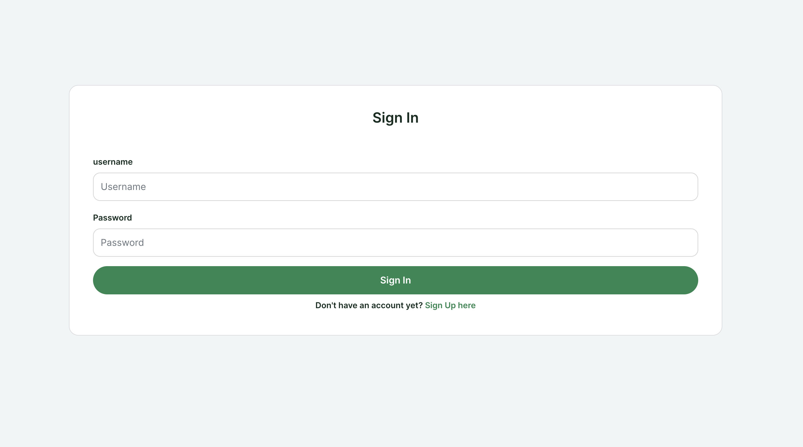

# PlantLife

With so many social media platforms out there, PlantLife aims to be a home for people who want to celebrate everything plant. Plant enthusiasts can present their newest acquisitions, share useful tips, buy, sell or exchange plants with others - or just geek out on any plant related topics.

[Link to the project](https://plantlife-a6c78053fb92.herokuapp.com/)

## Product Decisions 

### User Needs
As a user I want to...
- ...meet other plant enthusiasts so that I can build new connections with likeminded people
- ...exchange information with other users so that I can learn new things about plants
- ...follow people that post interesting plant content so that my feed filters out any uninteresting topics
- ...buy, sell or give away plants so that I can expand my collection or share my own plants with others

### MVP
PlantLife’s MVP is meant to be a simple version of a social media app that brings together plant enthusiasts from around the world. Core features consist of profile customization, reading, writing, editing and deleting posts and advertisements as well as an overview of all users with the option to follow each other.

## Design Decisions

### Wireframes
Creating the wireframes before the start of development allowed more time for the coding phase as a lot of time was saved by having less need for design changes.

[Link to all wireframes](https://github.com/dev-timm/plantlife/tree/main/src/assets/README/wireframes)

### Usability

#### Layout
The layout is usually organized within 1-2 columns so that the actions and important content are easy to see.

#### Colors
The primary color is a vibrant green that represents nature and plants. It has a good contrast to white, which is important for UI elements such as buttons. Overall the color should give a positive feeling to the user and make it easy to identify important elements.

## Features

### Sign Up
Clicking on the Sign Up link on the NavBar or the link below the Sign In page will bring the user to the Sign Up page. There the user can create an account by entering a username, password and the same password again. If the user already has an account, they can click on the link below the button which will bring them to the Sign In page.

### Sign In
Clicking on the Sign In link on the NavBar or the link below the Sign Up page will bring the user to the Sign In page. There the user can log in to their account by entering their username and password. If the user does not have an account yet, they can click on the link below the button which will bring them to the Sign Up page.

### NavBar
On top of each page is the NavBar. There are two versions of the NavBar - one is displayed when the user is not signed in and the other one is shown when the user is currently signed in. Whenever the user is not signed in they only see the logo with the sign in and sign up button. If the user is signed in they see a collection of all available links such as Feed, Bookmarks, Plant Lovers and Marketplace. Additionally users have access to a button to create a post or advertisement as well as their profile picture which gives them the option to view their profile or log out.

### Homepage
The Homepage is the first page visible to the users whether they are signed in or not. The page shows all posts ordered by date, a search bar and an order dropdown. There is also a widget on the side that displays popular users. Posts can be filtered through search by post title and username. Moreover, they can be ordered by date, number of likes and number of comments. The Homepage can be accessed by clicking on the Logo in the NavBar.

#### Feed
On the Feed page the users see posts from people they follow. Additionally, it contains the search bar, order dropdown and popular profiles widget. Posts can be filtered through search by post title and username. Moreover, they can be ordered by date, number of likes and number of comments.

#### Bookmarks
The Bookmarks page displays all posts the user has saved to view at a later time. Bookmarks can easily be created by clicking on the icon on the bottom right of a post. Clicking again will remove it from the Bookmarks. Additionally, the page contains the the search bar, order dropdown and popular profiles widget. Posts can be filtered through search by post title and username. Moreover, they can be ordered by date, number of likes and number of comments.

#### Plant Lovers
The Plant Lovers page gives users a list of all signed up users on the platform. By clicking on the “View Profile” link the user is sent to the profile page. The page also includes a search bar and the popular users widget. Profiles can be filtered through search by username.

### Marketplace
The Marketplace displays advertisements published by users. It is a place where users can offer and buy plants from each other. The page also includes a search bar and the popular users widget. Ads can be filtered through search by ad title and username. Moreover, they can be ordered by date and price.

### Like a Post
Each post can be liked by users who are signed in. Likes are placed at the bottom left with a counter next to it. Clicking once will add a like and clicking again will remove it. When a post is liked, the heart icon will turn green. Owner of a post is not able to like their own post.

### CRUD: Post
Signed in users have the possibility to create posts by clicking on the button in the NavBar. Users can add an image, title and content to a post. After creating the post users have the possibility to edit the post and/or delete it. Posts can be viewed on the homepage, feed or under bookmarks.

### CRUD: Comment
Each post can be commented by users who are signed in. Comment feature is placed at the bottom left together a counter next to it. After clicking on a post and scrolling down, users can view, create, edit and delete comments. Adding or removing a comment will impact the count next to the comment icon.

### CRUD: Advertisements
Signed in users have the possibility to create advertisements by clicking on the button in the NavBar. Users can add an image, title, plant type, price, availability, contact and content to an advertisement. After creating the advertisement users have the possibility to edit the ad and/or delete it. Ads can be viewed on the Marketplace page.

### Profile Page
The Profile Page enables users to customize their own profile and view profiles from other users. Information include username, bio, number of posts, number of followers and number of following. If the user is the profile owner they can edit the profile, username and password by clicking on the meatball menu on the right side. Additionally there is a section where users can see the posts and advertisements published by the profile owner. There is also a widget on the side that displays popular users.

### 404 Page
A 404 page is displayed whenever the user has entered a wrong url.

### Future Features

- Notification center to keep users up to date about new posts from people they follow etc.
- Display posts, ads and comments as a modal for a more seamless experience
- Add tags to posts so that it’s even easier to filter posts by topics relevant to users